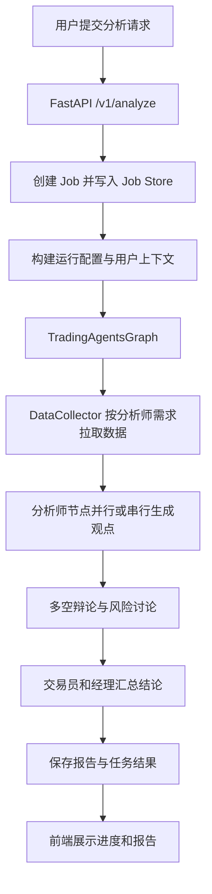
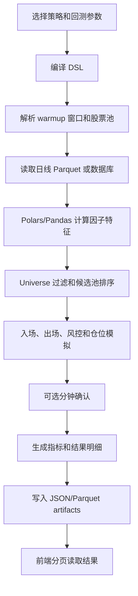
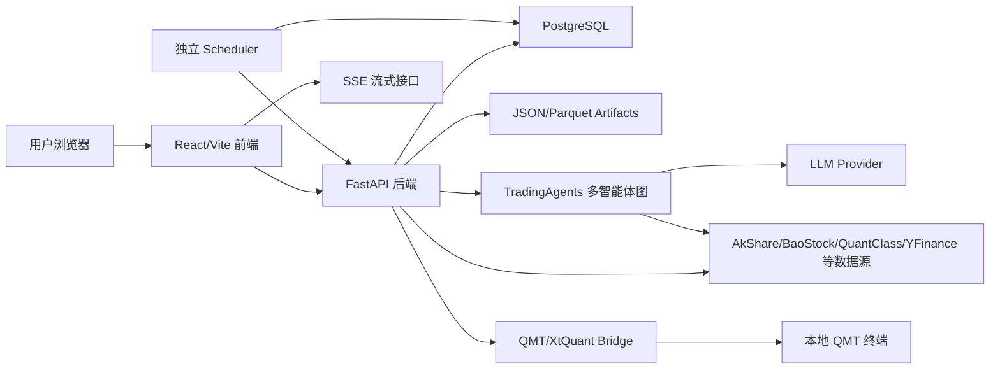
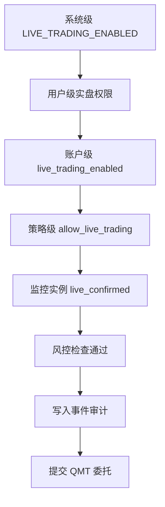
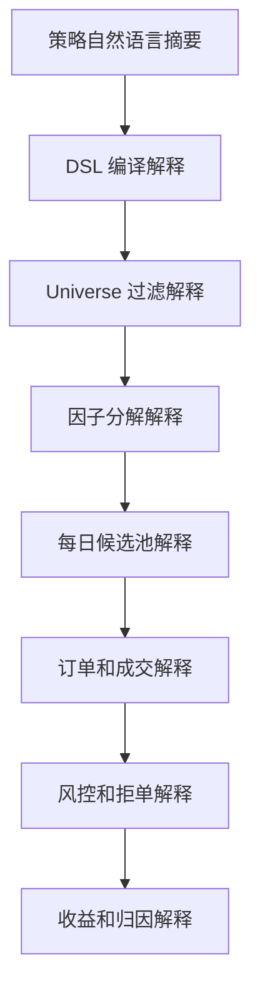

# 量化之神产品文档

版本：v1.0  
生成日期：2026-05-07  
适用项目：TradingAgents-AShare-main  
文档定位：面向产品、研发、测试、运维和业务使用方的综合产品说明

## 1. 产品概述

### 1.1 产品一句话

量化之神是一套面向 A 股市场的多智能体投研、行情治理、策略管理、回测验证、实时监控与 QMT 账户执行平台，目标是把“看市场、做研究、写策略、跑回测、盯信号、管仓位、复盘沉淀”整合到一个可持续迭代的工作台中。

### 1.2 产品定位

本项目不是单一聊天机器人，也不是单一回测脚本，而是一个覆盖投研和交易前后链路的量化研究平台：

- 对个人投资者：提供股票研究、每日复盘、自选跟踪、定时分析和历史报告沉淀。
- 对策略研究者：提供新策略管理、策略 DSL、官方策略包、因子库、编译预览、真引擎回测和策略进化实验。
- 对半自动交易用户：提供虚拟仓、实盘仓、实时监控、自动交易、风控熔断、事件追踪和策略收益对照。
- 对数据运维人员：提供多源行情接入、数据质量治理、缓存、增量同步和运行日志调试。

### 1.3 核心价值

1. 多智能体投研：通过市场、新闻、基本面、宏观、聪明钱、量价等分析师节点协同产出投资结论。
2. A 股本地化：股票代码、交易日历、涨跌停、T+1、整数手、QMT 账户、A 股资讯源和行业概念均围绕中国市场设计。
3. 策略工程化：用 DSL 描述策略，支持模板、官方策略包、版本、编译、回测、对比和进化。
4. 真实数据链路：支持 PostgreSQL、Parquet、QMT、AkShare、BaoStock、QuantClass 等多源行情和缓存。
5. 实时监控和执行：支持监控实例、事件流、订单、成交、持仓、收益对照、熔断和 QMT 桥接。
6. 可观测性：提供 job 状态、SSE 进度、运行日志、数据源治理和结果可信度提示。

### 1.4 当前产品成熟度

从代码结构看，项目已经具备完整 Web 产品骨架和多个可运行业务闭环。新策略管理、选股中心、回测、行情、实时监控、QMT 虚拟仓、资讯之眼、每日复盘和定时任务已具备较高完成度。旧入口已通过前端重定向收敛到新页面，后续仍需要持续统一接口口径、权限边界、文档和配置管理。

## 2. 用户角色与典型诉求

| 用户角色 | 典型诉求 | 主要使用模块 |
|---|---|---|
| 投研用户 | 快速了解股票、市场、资讯和交易建议 | 智能分析、资讯之眼、股票市场、历史报告 |
| 策略研究员 | 创建策略、调整因子、验证收益和风险 | 新策略管理、策略回测、因子库、官方策略包 |
| 交易执行用户 | 根据策略信号监控账户并处理订单 | 实时监控、虚拟仓、实盘仓、风控审计 |
| 组合管理用户 | 管理自选、持仓、定时分析和跟踪看板 | 自选 & 定时、跟踪看板、每日复盘 |
| 数据运维用户 | 保证行情源、缓存、同步任务和质量稳定 | 数据源治理、回测数据订阅、日志调试 |
| 管理员或高级用户 | 配置模型、Token、企业微信、系统运行状态 | 设置、Token、反馈、日志调试 |

## 3. 产品信息架构

前端主导航当前包括：

| 页面 | 路由 | 产品含义 |
|---|---|---|
| 控制台 | `/` | 最近报告、快速入口、跟踪看板摘要 |
| 资讯之眼 | `/news-eye` | A 股资讯抓取、情绪、关联标的和 AI 解读 |
| 选股中心 | `/selection-center` | 策略选股、催化选股入口、任务进度、结果排序和板块占比 |
| 股票市场 | `/stock-market` | 指数、榜单、板块、资金流、K 线和行情检索 |
| 智能分析 | `/analysis` | 多智能体股票分析任务入口 |
| 历史报告 | `/reports` | 分析报告列表、详情、删除和批量管理 |
| 每日复盘 | `/daily-review` | 市场、持仓、自选、主题和次日候选复盘 |
| 自选 & 定时 | `/portfolio` | 自选股、导入持仓、定时分析任务 |
| 新策略管理 | `/strategies` | 策略列表、模板、DSL 创建、编辑、版本和编译 |
| 策略回测 | `/backtest` | 回测创建、进度、近期记录、对比和结果入口 |
| 回测结果 | `/backtest/runs/:runId` | 回测详情、指标、候选池、订单、成交、快照 |
| 实时监控 | `/realtime` | 监控实例、事件流、订单、成交、持仓和收益对照 |
| 虚拟仓 | `/virtual-warehouse` | QMT 账户快照、委托、成交、下单和清仓任务 |
| 实盘仓 | `/live-warehouse` | QMT 实盘资产、持仓、委托、成交核对和受控交易入口 |
| 跟踪看板 | `/tracking-board` | 持仓和自选跟踪摘要 |
| 日志调试 | `/debug/logs` | 运行日志源、日志检索和流式查看 |
| 反馈留言 | `/feedback` | 用户反馈提交、列表和已读管理 |
| 设置 | `/settings` | 模型、运行配置、通知和数据源治理入口 |

## 4. 产品模块详解

### 4.1 登录与用户体系

#### 功能说明

系统通过邮箱验证码登录，登录后前端保存访问 Token，并在 API 请求中附带 `Authorization: Bearer <token>`。

#### 核心能力

- 请求登录验证码：`POST /v1/auth/request-code`
- 验证验证码并登录：`POST /v1/auth/verify-code`
- 获取当前用户：`GET /v1/auth/me`
- 用户 Token 管理：`GET/POST/DELETE /v1/tokens`
- 用户运行配置、LLM 配置、企业微信 Webhook 和通知偏好由配置服务维护。

#### 产品边界

- 当前代码支持开发环境返回 `dev_code`，生产环境应关闭或严格控制。
- 用户隔离依赖用户 ID、鉴权依赖和数据库查询过滤，需要持续在新增路由中保持一致。

### 4.2 控制台

#### 功能说明

控制台提供最近分析报告、快速开始入口和跟踪看板摘要，适合作为用户登录后的工作台首页。

#### 核心信息

- 最近报告：从报告接口拉取最近记录。
- 快速操作：跳转新分析、历史报告、设置等常用入口。
- 跟踪摘要：展示自选、持仓和定时分析相关概览。

### 4.3 智能分析

#### 功能说明

智能分析是多智能体投研入口。用户输入股票代码、日期、目标和持仓上下文，系统创建分析 job，后端运行 TradingAgents 图，产出结构化报告和投资建议。

#### 多智能体结构

核心分析角色包括：

- 市场分析师：行情、技术指标、走势。
- 新闻分析师：新闻、公告、事件影响。
- 社交媒体分析师：市场关注度和文本情绪。
- 基本面分析师：财务数据、估值和业绩。
- 宏观分析师：宏观环境、行业和政策。
- 聪明钱分析师：资金流、龙虎榜等交易行为。
- 量价分析师：成交量、价格结构和短线强弱。
- 多空研究员：牛方和熊方辩论。
- 交易员：形成交易动作。
- 风控讨论者：激进、中性、保守视角给出风险判断。
- 研究经理和风险经理：汇总并输出最终建议。

#### 运行流程



#### 输入要素

- 股票代码或股票名称。
- 交易日期。
- 分析周期：短线、中线、长线等。
- 用户持仓、成本、目标、交易计划等上下文。
- 选择的分析师集合。

#### 输出要素

- 最终交易建议：买入、卖出、持有、加仓、减仓、观察等。
- 置信度、目标价、止损价、风险提示。
- 多智能体过程信息、辩论摘要、风险讨论。
- 可沉淀为历史报告。

### 4.4 历史报告

#### 功能说明

历史报告用于沉淀智能分析结果，支持列表、详情、按标的批量查询、删除和公告查看。

#### 核心接口

- `POST /v1/reports`
- `GET /v1/reports`
- `POST /v1/reports/latest-by-symbols`
- `GET /v1/reports/{report_id}`
- `DELETE /v1/reports/{report_id}`
- `POST /v1/reports/batch/delete`
- `GET /v1/announcements/latest`

#### 产品价值

报告是用户复盘、定时任务、持仓跟踪和每日复盘的重要输入。它把一次性 AI 分析变成可追踪资产。

### 4.5 自选股、持仓导入与定时分析

#### 功能说明

用户可以维护自选股、导入或识别持仓，设置定时分析任务。调度器在指定时间自动运行分析，并可发送邮件或企业微信通知。

#### 自选股能力

- 查询自选：`GET /v1/watchlist`
- 添加自选：`POST /v1/watchlist`
- 删除自选：`DELETE /v1/watchlist/{item_id}`
- 支持股票名称、代码和批量文本解析。

#### 持仓导入能力

- 查看导入状态：`GET /v1/portfolio/imports`
- 同步导入持仓：`POST /v1/portfolio/imports`
- 清空导入：`DELETE /v1/portfolio/imports`
- 图片识别持仓：`POST /v1/portfolio/parse-image`
- 跟踪看板：`GET /v1/dashboard/tracking-board`

#### 定时分析能力

- 查询定时任务：`GET /v1/scheduled`
- 创建定时任务：`POST /v1/scheduled`
- 修改定时任务：`PATCH /v1/scheduled/{item_id}`
- 删除定时任务：`DELETE /v1/scheduled/{item_id}`
- 手动触发：`POST /v1/scheduled/{item_id}/trigger`
- 批量启停、删除、触发：`PATCH /v1/scheduled/batch`、`POST /v1/scheduled/batch/delete`、`POST /v1/scheduled/batch/trigger`

#### 调度器行为

独立调度器由 `tradingagents-scheduler` 或 `python -m scheduler.main` 启动，默认每分钟轮询一次定时任务，按交易日、触发时间和并发限制执行。

关键配置：

- `SCHEDULER_CONCURRENCY`：调度器并发数，默认 3。
- 定时任务通常在交易日盘后执行，避免盘中使用未收盘数据。
- 执行成功后可以发送邮件和企业微信通知。

### 4.6 每日复盘

#### 功能说明

每日复盘聚合市场概览、指数、涨跌榜、板块资金流、自选股、持仓、历史报告和资讯，生成结构化 JSON 复盘。

#### 输出结构

- 今日市场总览。
- 我的持仓与自选复盘。
- 当前主线与核心个股。
- 当前重点个股。
- 次日主线与候选股。
- 次日候选股。
- 风险观察点。

#### 核心接口

- `GET /v1/daily-reviews`
- `GET /v1/daily-reviews/history`
- `POST /v1/daily-reviews/generate`
- `GET /v1/daily-reviews/config`
- `PATCH /v1/daily-reviews/config`

#### 自动化能力

每日复盘服务有后台轮询任务，默认触发时间为 `21:10`，可配置是否启用、推送和触发时间。

### 4.7 股票市场

#### 功能说明

股票市场页面提供行情检索、指数概览、个股涨跌榜、板块涨跌榜、板块资金流、K 线和缠论辅助数据。

#### 核心接口

- 股票搜索：`GET /v1/market/stock-search`
- 日 K 线：`GET /v1/market/kline`
- 分时或分钟线：`GET /v1/market/intraday`
- 实时报价：`GET /v1/market/quote`
- 市场概览：`GET /v1/market/overview`
- 完整性报告：`GET /v1/market/integrity-report`
- 缠论叠加：`GET /v1/market/kline/chanlun`
- 热门股票：`GET /v1/market/hot-stocks`

#### 数据来源

市场页可能组合使用 QMT、QMT Bridge、本地 PostgreSQL、AkShare、缓存等来源。页面配有数据源治理提示，用于提醒用户某个指标是否来自实时链路、数据库缓存或外部数据。

### 4.8 资讯之眼

#### 功能说明

资讯之眼通过后台任务抓取全市场和自选相关资讯，进行情绪、行业、标的关联和关键词归因，并支持 AI 分析。

#### 资讯来源

当前服务代码中接入的主要来源包括：

- 财联社电报。
- 东方财富全球快讯。
- 东方财富财经早餐。
- 东方财富个股新闻。

#### 结构化标签

资讯会识别：

- 正面和负面情绪。
- 相关行业主题。
- 相关股票代码和股票名称。
- A 股市场关键词、全球影响因素和噪音过滤。

#### 核心接口

- 资讯列表：`GET /v1/news-eye/items`
- 手动刷新：`POST /v1/news-eye/refresh`
- AI 分析：`POST /v1/news-eye/analyze`

### 4.9 策略管理

#### 功能说明

策略管理是策略生命周期中心，支持策略创建、编辑、模板、官方策略包、DSL 编译、版本管理、克隆、激活和归档。

#### 策略类型

| 类型 | 含义 |
|---|---|
| `selection` | 选股策略 |
| `trading` | 交易策略 |
| `risk` | 风控策略 |
| `portfolio` | 组合策略 |

#### 策略状态

| 状态 | 含义 |
|---|---|
| `draft` | 草稿 |
| `active` | 运行中 |
| `paused` | 暂停 |
| `archived` | 归档 |

#### 策略 DSL 主要结构

```json
{
  "strategy_type": "portfolio",
  "universe": {
    "market": "A_SHARE",
    "include_concepts": [],
    "exclude_st": true,
    "exclude_suspended": true,
    "min_listing_days": 250,
    "filters": []
  },
  "factor_model": {
    "engine": "polars_expr",
    "score_method": "weighted_sum",
    "rebalance_frequency": "weekly",
    "factors": [],
    "select": {
      "top_n": 30,
      "min_score": 0.65
    }
  },
  "entry": {
    "logic": "all",
    "conditions": []
  },
  "exit": {
    "logic": "any",
    "conditions": []
  },
  "position": {},
  "risk": {},
  "execution": {}
}
```

#### 因子库能力

当前因子注册表支持成长、资金流、动量、波动、RSI、ATR、市值、换手率、均线乖离、成交额 ZScore、首日波段等因子。

代表性因子：

- `net_profit_growth_yoy`
- `profit_growth_proxy`
- `money_flow_strength_20d`
- `momentum_20d`
- `momentum_60d`
- `volatility_20d`
- `rsi_14`
- `atr_14`
- `float_market_cap`
- `turnover_rate`
- `ma_gap_5_20`
- `amount_zscore_20d`
- `first_day_band_cross`
- `first_day_band_dead_cross`

#### 核心接口

- 因子列表：`GET /v1/factors`
- 因子详情：`GET /v1/factors/{factor_name}`
- AI 草稿：`POST /v1/strategies/llm-draft`
- DSL Schema：`GET /v1/strategies/dsl-schema`
- 编译预览：`POST /v1/strategies/compile-preview`
- 策略模板：`GET /v1/strategies/templates`
- 官方策略包：`GET /v1/strategies/packs`
- 克隆官方策略包：`POST /v1/strategies/packs/{pack_id}/clone`
- 策略列表：`GET /v1/strategies`
- 创建策略：`POST /v1/strategies`
- 策略详情：`GET /v1/strategies/{strategy_id}`
- 更新策略：`PUT /v1/strategies/{strategy_id}`
- 删除策略：`DELETE /v1/strategies/{strategy_id}`
- 策略版本：`GET/POST /v1/strategies/{strategy_id}/versions`
- 克隆策略：`POST /v1/strategies/{strategy_id}/clone`
- 激活或暂停：`POST /v1/strategies/{strategy_id}/activate`
- 同步官方策略：`POST /v1/strategies/{strategy_id}/sync-official`
- 编译策略：`POST /v1/strategies/{strategy_id}/compile`

### 4.10 策略回测

#### 功能说明

策略回测用于验证策略在历史数据上的表现。新策略管理回测支持真引擎、分钟确认、候选池输出、订单、成交、持仓、风险事件、交易快照和大结果分页读取。

#### 回测输入

- 策略 ID 或 DSL。
- 回测起止日期。
- 初始资金。
- 频率：日线或日线加分钟确认。
- 基准指数。
- 股票池或全市场。
- 是否启用分钟确认。
- 是否启用 walk-forward。

#### 回测输出

- 指标：总收益、年化收益、夏普、最大回撤、胜率、盈亏比、波动率等。
- 资金曲线。
- 交易列表。
- 信号列表。
- 持仓历史。
- 订单流水。
- 每日候选池。
- 分钟确认结果。
- 交易快照和未来收益标签。
- 诊断信息：数据源、引擎、fallback 状态、分钟数据缺失、风控事件。

#### 执行链路



#### 性能现状

最近一次真实大数据压测使用数据集：

- 日线 Parquet：37 个文件。
- 数据大小：670.66MB。
- 总行数：18,089,806。
- 股票数：12,244。
- 压测窗口：2025-01-01 至 2026-05-06。

关键结果：

| 项目 | 当前结果 |
|---|---:|
| 全市场日线窗口读取 | 1.4621s |
| 全市场特征计算 | 2.4543s |
| 全市场策略回测 | 5.6189s |
| 全市场回测 RSS 增量 | 1782.12MB |
| 最大已有 watchlist 分页 1000 行 | 0.0157s |
| 实时事件初始页 1000 条 | 0.0244s |
| 实时事件 cursor 页 200 条 | 0.0078s |

已实现的性能优化包括：

- 日线 Parquet 通过 DuckDB predicate pushdown 读取。
- 按年份裁剪 Parquet 文件。
- 按 DSL 推导需要读取的原始列。
- 全市场回测中将概念 universe 预过滤前移。
- Polars 向量化计算因子。
- 避免百万级行上重复拼接行业和概念字符串。
- 回测大结果按 Parquet 分页读取。
- 实时事件采用 cursor 和队列推送。

#### 核心接口

- 创建回测：`POST /v1/backtests`
- 回测列表：`GET /v1/backtests`
- 回测详情：`GET /v1/backtests/{run_id}`
- 回测进度流：`GET /v1/backtests/{run_id}/stream`
- 取消回测：`POST /v1/backtests/{run_id}/cancel`
- 回测对比：`POST /v1/backtests/compare`
- 指标：`GET /v1/backtests/{run_id}/metrics`
- 资金曲线：`GET /v1/backtests/{run_id}/equity`
- 交易：`GET /v1/backtests/{run_id}/trades`
- 快照：`GET /v1/backtests/{run_id}/trade-snapshots`
- 信号：`GET /v1/backtests/{run_id}/signals`
- 持仓：`GET /v1/backtests/{run_id}/positions`
- 订单：`GET /v1/backtests/{run_id}/orders`
- 候选池：`GET /v1/backtests/{run_id}/watchlists`
- 分钟确认：`GET /v1/backtests/{run_id}/minute-confirmations`

### 4.11 策略进化实验

#### 功能说明

策略进化实验基于已有回测的快照和指标，生成候选改进策略，例如资金流阈值调整、低波过滤、利润增速筛选等。用户可以查看候选并接受为新策略。

#### 核心接口

- 创建进化实验：`POST /v1/evolution/experiments`
- 查询实验：`GET /v1/evolution/experiments/{experiment_id}`
- 查询候选：`GET /v1/evolution/experiments/{experiment_id}/candidates`
- 接受候选：`POST /v1/evolution/candidates/{candidate_id}/accept`

### 4.12 纸交易账户

#### 功能说明

纸交易账户用于把策略信号落到模拟账户中，方便验证策略信号在交易流水层面的可用性。

#### 核心接口

- 创建纸交易账户：`POST /v1/paper/accounts`
- 账户列表：`GET /v1/paper/accounts`
- 跑策略：`POST /v1/paper/accounts/{account_id}/run-strategy`
- 订单：`GET /v1/paper/accounts/{account_id}/orders`
- 持仓：`GET /v1/paper/accounts/{account_id}/positions`
- 权益：`GET /v1/paper/accounts/{account_id}/equity`

### 4.13 实时监控

#### 功能说明

实时监控将策略、账户、监控池、行情和风控组合起来，支持多周期买卖点配置、自动或只读监控模式。每个监控实例会生成精简事件流，前端展示信号、订单、成交、持仓、风控、错误和策略收益对照。

#### 监控实例状态

- `ready`：已创建，等待启动。
- `running`：运行中。
- `paused`：暂停。
- `halted`：停止。
- `fused`：风控熔断。
- `error`：错误状态。

#### 关键能力

- 监控池解析：策略持仓、自选股、账户持仓等组合。
- 策略编译校验：DSL 不通过不能启动。
- 实盘保护：实盘自动交易必须账户可用、交易开关开启并通过风控。
- 事件流：监控事件实时推送到前端。
- 风控熔断：触发风控后暂停或熔断监控。
- QMT 账户联动：读取订单、成交和持仓。
- 收益对照：按监控实例统计策略收益、不动收益和超额收益。

#### 核心接口

- 创建监控：`POST /v1/realtime/monitors`
- 监控列表：`GET /v1/realtime/monitors`
- 监控详情：`GET /v1/realtime/monitors/{monitor_id}`
- 删除监控：`DELETE /v1/realtime/monitors/{monitor_id}`
- 启动：`POST /v1/realtime/monitors/{monitor_id}/start`
- 暂停：`POST /v1/realtime/monitors/{monitor_id}/pause`
- 停止：`POST /v1/realtime/monitors/{monitor_id}/stop`
- 恢复：`POST /v1/realtime/monitors/{monitor_id}/resume`
- 手动跑一轮：`POST /v1/realtime/monitors/{monitor_id}/run-once`
- 熔断重置：`POST /v1/realtime/monitors/{monitor_id}/fuse-reset`
- 事件列表：`GET /v1/realtime/monitors/{monitor_id}/events`
- 事件流：`GET /v1/realtime/monitors/{monitor_id}/stream`
- 订单事件：`GET /v1/realtime/monitors/{monitor_id}/orders`
- 成交事件：`GET /v1/realtime/monitors/{monitor_id}/trades`
- 持仓快照：`GET /v1/realtime/monitors/{monitor_id}/positions`
- 收益对照：`GET /v1/realtime/monitors/{monitor_id}/performance`

### 4.14 虚拟仓与实盘仓

#### 功能说明

虚拟仓负责连接 QMT 或 XtQuant 账户链路，读取账户、持仓、委托、成交，支持刷新、诊断、下单、撤单、批量清仓和同步配置。

#### QMT 账户能力

- 账户总览：资产、现金、市值、盈亏、持仓。
- 持仓列表：证券代码、名称、数量、可用数量、成本、现价、市值、浮盈亏。
- 委托列表和成交列表。
- 下单：买卖、数量、价格、价格类型。
- 撤单。
- 批量清仓任务和 SSE 进度流。
- 后台刷新和最近缓存快照。
- 多账户配置和账户角色：paper/live。

#### 核心接口

- QMT 总览：`GET /v1/virtual-warehouse/qmt/overview`
- 手动刷新：`POST /v1/virtual-warehouse/qmt/refresh`
- 委托列表：`GET /v1/virtual-warehouse/qmt/orders`
- 成交列表：`GET /v1/virtual-warehouse/qmt/trades`
- 下单：`POST /v1/virtual-warehouse/qmt/orders`
- 批量清仓：`POST /v1/virtual-warehouse/qmt/orders/bulk-sell`
- 清仓任务详情：`GET /v1/virtual-warehouse/qmt/orders/bulk-sell/{task_id}`
- 清仓任务流：`GET /v1/virtual-warehouse/qmt/orders/bulk-sell/{task_id}/stream`
- 撤单：`POST /v1/virtual-warehouse/qmt/orders/{order_id}/cancel`
- 同步：`POST /v1/virtual-warehouse/qmt/sync`
- 诊断：`GET /v1/virtual-warehouse/qmt/diagnostics`
- 同步配置：`GET /v1/virtual-warehouse/qmt/sync-profiles`
- 更新同步配置：`POST /v1/virtual-warehouse/qmt/sync-profiles/{account_key}`

#### 风险提示

实盘交易能力必须谨慎启用。当前产品已有 live guard 和显式确认要求，但仍建议在部署时增加账户白名单、IP 白名单、操作审计、二次确认和最大订单约束。

### 4.15 回测数据订阅与多源行情治理

#### 功能说明

回测数据模块负责行情数据任务、订阅配置、覆盖统计、质量检查、缓存同步和多源使用状态。

#### 核心接口

- 创建任务：`POST /v1/backtest-data/tasks`
- 任务列表：`GET /v1/backtest-data/tasks`
- 任务详情：`GET /v1/backtest-data/tasks/{task_id}`
- 创建配置：`POST /v1/backtest-data/configs`
- 配置列表：`GET /v1/backtest-data/configs`
- 订阅状态：`GET /v1/backtest-data/configs/{config_id}/subscription-status`
- 立即运行配置：`POST /v1/backtest-data/configs/{config_id}/run`
- 统计：`GET /v1/backtest-data/stats`
- 覆盖日历：`GET /v1/backtest-data/daily-kline/coverage-calendar`
- 日线缓存同步：`POST /v1/backtest-data/daily-kline/cache-sync`
- 批量下载：`POST /v1/backtest-data/batch-download`
- 数据源列表：`GET /v1/backtest-data/data-sources`
- 下载状态：`GET /v1/backtest-data/download-status`
- 质量检查：`GET /v1/backtest-data/quality-check/{table_name}`
- 质量报告：`GET /v1/backtest-data/quality-report`
- 来源使用：`GET /v1/backtest-data/source-usage`
- 来源状态：`GET /v1/backtest-data/source-status/{source}`

#### 多源发布机制

行情管线按来源拆分 raw 表，再进行归一化、候选选择、质量检查、发布表写入和旧表镜像。日线来源优先级示例：

| 来源 | 优先级 |
|---|---:|
| QuantClass | 110 |
| AkShare | 100 |
| BaoStock | 80 |
| PostgreSQL | 70 |
| EFinance | 60 |

分钟线来源优先级示例：

| 来源 | 优先级 |
|---|---:|
| QMT | 100 |
| TDX | 90 |
| PostgreSQL | 70 |
| AkShare | 50 |

### 4.16 数据源治理中心

#### 功能说明

数据源治理统一登记页面使用的数据来源、类别、可靠性、说明和 caveat，避免用户把缓存、合成数据、实时数据和真实引擎结果混为一谈。

#### 已登记来源类型

- QMT 实时行情链路。
- XtQuant/QMT 账户链路。
- QMT Bridge 回退链路。
- PostgreSQL 本地行情库。
- AkShare 外部数据。
- 本地缓存快照。
- Synthetic 合成数据。
- 真引擎和回退引擎。
- 资讯缓存层。
- 实时事件流。

#### 产品意义

数据源治理是本产品可信度设计的关键。对于投资和交易产品，用户必须知道当前看到的数据是实时、缓存、回退还是合成。

### 4.17 日志调试与系统健康

#### 功能说明

日志调试页面提供运行日志源列表、分页查询和 SSE 流式查看。系统健康接口提供服务状态、数据源注册表和行情状态。

#### 核心接口

- 健康检查：`GET /healthz`
- 系统数据源：`GET /v1/system/data-sources`
- 市场数据状态：`GET /v1/system/market-data-status`
- 日志来源：`GET /v1/debug/log-sources`
- 日志查询：`GET /v1/debug/logs`
- 日志流：`GET /v1/debug/logs/stream`
- Job 状态：`GET /v1/jobs/{job_id}`
- Job 结果：`GET /v1/jobs/{job_id}/result`

### 4.18 设置、模型和通知

#### 功能说明

设置模块管理用户运行配置、LLM Provider、模型名称、API Key、企业微信通知和 warmup 探测。

#### 支持的 LLM Provider

从依赖和客户端代码看，项目支持：

- OpenAI 兼容接口。
- Anthropic。
- Google Gemini。

#### 核心接口

- 获取配置：`GET /v1/config`
- 更新配置：`PATCH /v1/config`
- 配置 warmup：`POST /v1/config/warmup`
- 企业微信 warmup：`POST /v1/config/wecom/warmup`

## 5. 技术架构

### 5.1 总体架构



### 5.2 后端分层

| 目录 | 职责 |
|---|---|
| `api/app.py` | FastAPI 应用装配、CORS、路由注册 |
| `api/lifespan.py` | 启停生命周期、后台任务和初始化 |
| `api/routes/` | HTTP 路由层 |
| `api/services/` | 业务逻辑层 |
| `api/core/` | 公共工具、配置、安全、缓存、调度辅助 |
| `api/schemas/` | 请求和响应模型 |
| `api/models/` | 策略平台相关数据库模型 |
| `tradingagents/` | 多智能体投研、数据流、策略和回测核心 |
| `scheduler/` | 独立定时任务进程 |
| `scripts/` | 数据同步、启动、测试、压测和运维脚本 |
| `frontend/` | React 前端 |

### 5.3 前端技术栈

- React 18。
- React Router。
- Zustand。
- Tailwind CSS。
- Recharts。
- Lightweight Charts。
- React Markdown。
- Lucide React。
- TanStack React Virtual。
- Vite。
- TypeScript。

### 5.4 后端技术栈

- FastAPI。
- SQLAlchemy。
- PostgreSQL。
- DuckDB。
- Polars。
- Pandas。
- PyArrow/Parquet。
- LangGraph。
- LangChain Core。
- AkShare、BaoStock、YFinance。
- Redis 可作为 Job Store。
- Uvicorn。

## 6. 数据架构

### 6.1 主要数据域

| 数据域 | 代表表或文件 | 说明 |
|---|---|---|
| 用户与配置 | `users`、用户配置表 | 登录、模型、通知和偏好 |
| 报告 | `reports` | 智能分析结果 |
| 自选与定时 | `watchlist`、`scheduled_analysis` | 自选股和定时分析任务 |
| 持仓导入 | imported portfolio 相关表 | 手动导入或识别的持仓 |
| 日线行情 | `stock_daily_kline`、`market_stock_daily_kline`、Parquet cache | 日线 OHLCV、财务、市值、行业 |
| 分钟行情 | `stock_minute_kline`、`market_stock_minute_kline` | 分钟 OHLCV |
| 指数行情 | `index_daily_kline`、`index_minute_kline` | 指数日线和分钟线 |
| 策略 | `strategies` | 策略定义、状态和版本 |
| 回测 | artifacts under `data/artifacts/backtests` | 指标、交易、候选池、订单、曲线 |
| 纸交易 | `paper_accounts`、`paper_orders` | 模拟账户和订单 |
| 扩展行情 | `stock_chip_distribution`、`stock_money_flow`、`stock_financial_snapshots` | 筹码、资金流和财务快照 |
| 实时监控 | `realtime_monitors`、`realtime_events` | 监控实例、事件和收益对照 |
| QMT 快照 | QMT snapshot tables | 账户、持仓、委托和成交缓存 |
| 资讯 | `market_news_items` 等 | 新闻缓存、标的和行业映射 |
| 每日复盘 | `daily_reviews` | 每日结构化复盘 |

### 6.2 Parquet 缓存

日线缓存位于：

```text
data/artifacts/market_cache/daily_kline
```

设计要点：

- 按年份文件组织，读取时按回测日期裁剪文件。
- DuckDB 负责扫描和谓词下推。
- 支持列投影，避免加载不必要字段。
- 混合 schema 时通过 `union_by_name=true` 合并。

### 6.3 回测 artifacts

回测结果位于：

```text
data/artifacts/backtests/{run_id}
```

典型文件：

- `metrics.json`
- `engine_diagnostics.json`
- `compiled_strategy.json`
- `equity.json/parquet`
- `trades.json/parquet`
- `orders.json/parquet`
- `positions.json/parquet`
- `signals.json/parquet`
- `watchlists.json/parquet`
- `minute_confirmations.json/parquet`
- `trade_snapshots.json/parquet`

### 6.4 Job Store

Job Store 用于分析任务、回测任务和 SSE 进度。项目支持内存或 Redis 化 Job Store。生产环境推荐 Redis，避免 API 进程重启后任务状态丢失。

## 7. 核心业务流程

### 7.1 从个股分析到报告沉淀

1. 用户在智能分析页输入股票。
2. 前端调用 `/v1/analyze` 创建 job。
3. 后端构建用户配置和分析上下文。
4. TradingAgents 多智能体图运行。
5. Job Store 推送进度。
6. 生成报告并写入报告表。
7. 前端进入报告详情或历史报告列表。

### 7.2 从策略创建到回测

1. 用户从模板、官方策略包或 AI 草稿创建策略。
2. 用户编辑 DSL、因子、筛选、入场、出场、仓位和风控。
3. 前端调用编译预览。
4. 编译通过后保存策略。
5. 用户在回测页选择策略和参数。
6. 后端运行真引擎回测。
7. artifacts 写入本地。
8. 前端展示指标、图表、候选池、订单、成交和快照。
9. 用户可发起策略进化或克隆新版本。

### 7.3 从策略到实时监控

1. 用户选择策略、账户和监控池。
2. 后端校验策略 DSL 是否编译通过。
3. 创建实时监控实例。
4. 启动实例后后台按周期拉取行情、分钟线和账户状态。
5. 根据策略逻辑生成信号。
6. 风控判断是否允许下单。
7. 按账户状态与风控结果执行自动下单或只读监控。
8. 事件写入 `realtime_events` 并通过 SSE 推送。
9. 前端展示实时事件、订单、成交和持仓。

### 7.4 从 QMT 到虚拟仓

1. 用户配置 QMT 账户和 Bridge。
2. 虚拟仓请求账户总览。
3. 服务优先读取实时链路，失败时回退到近期缓存或数据库缓存。
4. 用户可以查看持仓、委托、成交。
5. 用户可以提交订单、撤单或启动批量清仓。
6. 批量清仓任务通过 SSE 返回进度。

### 7.5 从资讯抓取到每日复盘

1. 资讯之眼后台轮询外部资讯源。
2. 新闻入库并结构化标的、行业和情绪。
3. 每日复盘聚合新闻、市场、报告、持仓和自选。
4. LLM 输出结构化复盘 JSON。
5. 用户在每日复盘页查看，也可通过企业微信推送。

## 8. 非功能需求与产品约束

### 8.1 性能

当前项目已经针对大数据回测做了优化。仍建议设定以下产品指标：

| 场景 | 建议指标 |
|---|---|
| 股票搜索 | P95 小于 300ms |
| 单股票 K 线查询 | P95 小于 1s |
| 市场概览 | P95 小于 8s，失败可降级 |
| 全市场日线窗口读取 | 约 1.5s 量级 |
| 全市场回测 | 当前压测约 5.6s |
| 回测大表分页 | 1000 行分页小于 100ms |
| 实时事件 cursor 页 | 200 条小于 50ms |

### 8.2 可靠性

- 实时行情和 QMT 账户依赖本地终端，必须提供缓存回退和明确提示。
- 外部数据源可能限流或变更接口，必须保留多源 fallback。
- LLM 输出不稳定，结构化 JSON 需要修复、校验和默认值。
- 回测结果必须标记数据源、是否 synthetic、是否 fallback engine。

### 8.3 安全

重点安全要求：

- Token 和 API Key 加密存储。
- 前端只显示脱敏配置。
- 实盘交易必须显式确认。
- 实盘账户应增加白名单和二次确认。
- 所有用户数据必须按 `user_id` 隔离。
- 日志中不得输出完整 API Key、Token、Webhook。

### 8.4 可观测性

已有能力：

- 健康检查。
- 运行日志源。
- SSE 日志流。
- Job 状态。
- 数据源治理。
- 回测诊断。
- 实时监控事件流。

建议继续补充：

- Prometheus 指标或统一 metrics。
- 关键任务耗时统计。
- 数据同步失败率。
- LLM 调用成本和失败率。
- QMT Bridge 连接状态历史。

## 9. 部署与运行

### 9.1 后端启动

```bash
uv sync --frozen --no-dev
uv run uvicorn api.app:app --reload --port 8500
```

### 9.2 前端启动

```bash
cd frontend
npm install
npm run dev
```

### 9.3 调度器启动

```bash
uv run tradingagents-scheduler
```

### 9.4 一键启动

```bash
./scripts/start_services.sh
```

### 9.5 常用环境变量

| 变量 | 含义 |
|---|---|
| `DATABASE_URL` | 主数据库连接 |
| `TA_LLM_PROVIDER` | LLM Provider |
| `TA_LLM_DEEP` | 深度思考模型 |
| `TA_LLM_QUICK` | 快速模型 |
| `TA_BASE_URL` | OpenAI 兼容接口地址 |
| `TA_API_KEY` | LLM API Key |
| `TA_LANGUAGE` | 提示词语言 |
| `SCHEDULER_CONCURRENCY` | 定时任务并发 |
| `DAILY_KLINE_PARQUET_ROOT` | 日线 Parquet 缓存目录 |
| `TA_SKIP_STARTUP_DDL` | 是否跳过启动 DDL |
| `CLEAR_JOB_STORE_ON_STARTUP` | 是否启动时清空 Job Store |
| `NEWS_EYE_POLL_SECONDS` | 资讯之眼后台轮询间隔 |
| `DAILY_REVIEW_POLL_SECONDS` | 每日复盘后台轮询间隔 |
| `QMT_SNAPSHOT_TIMEOUT_SECONDS` | QMT 快照超时 |

## 10. 测试与质量保障

### 10.1 后端测试

```bash
pytest -q
```

重点测试覆盖：

- API smoke。
- Job Store。
- 配置 fallback。
- 数据源治理。
- 市场数据管线。
- 分钟数据服务。
- 策略平台仓储。
- 策略真引擎。
- 策略扩展。
- 实时监控。
- QMT 市场和同步服务。
- 企业微信和邮件通知。
- 每日复盘和资讯之眼。

### 10.2 前端测试

```bash
cd frontend
npm test
```

当前前端有 App、侧边栏导航、进度反馈等测试。

### 10.3 压测

真实数据压测脚本：

```bash
python scripts/real_pressure_benchmark.py
```

输出目录：

```text
eval_results/
```

## 11. 现有风险与改进建议

### 11.1 产品风险

1. 策略和回测能力较强，但用户需要理解数据源可信度，否则可能误读 synthetic 或 fallback 结果。
2. 实盘仓能力需要持续收紧风控边界，包括账户白名单、订单上限、交易开关和审计日志。
3. 旧路由已经重定向到新入口，文档和测试需要持续跟随当前页面口径。
4. 多源数据链路复杂，外部源接口变动会影响资讯、行情和复盘质量。
5. LLM 输出存在不确定性，投资建议必须持续强调辅助决策属性。

### 11.2 技术风险

1. 后端启动 DDL 和生产数据库迁移边界需要进一步明确。
2. 大量 artifacts 写入本地目录，长期运行需要清理、归档和对象存储方案。
3. SSE 连接和后台任务需要在多进程部署时明确状态共享方案。
4. QMT Bridge 运行在本地 Windows 环境，网络、权限、终端状态都会影响产品体验。
5. Redis Job Store 在生产环境应作为默认方案，而不是内存方案。

### 11.3 体验改进建议

1. 在所有涉及投资结论的页面统一展示数据可信度标签。
2. 策略 DSL 编辑器增加字段补全、错误定位和可视化解释。
3. 回测结果页增加“为什么买入/卖出”的单票链路可解释视图。
4. 实时监控页增加风控规则模拟和下单前检查清单。
5. 每日复盘增加用户自定义关注主题和行业。
6. 控制台增加今日待处理事项：失败任务、数据缺口、待复盘报告、异常监控。

## 12. 建议产品路线图

### 12.1 近期

- 持续统一策略 API 与新策略管理入口。
- 补充产品级权限和管理员角色。
- 完善 QMT 实盘开关、白名单、订单限额和审计。
- 完成数据源治理在所有核心页面的统一展示。
- 为回测 artifacts 增加清理策略。

### 12.2 中期

- 建立策略市场或策略模板中心。
- 增加可视化 DSL 编辑器。
- 建立回测参数批量优化和对比报告。
- 增加组合层面的归因、行业暴露和风险预算。
- 将每日复盘和资讯之眼联动成主题跟踪系统。

### 12.3 长期

- 多账户、多用户团队协作。
- 策略上线前的校验、灰度和回滚机制。
- 实盘交易全链路审计与回放。
- 数据湖和对象存储化 artifacts。
- 模型调用成本治理和多 Provider 自动降级。

## 13. 术语表

| 术语 | 说明 |
|---|---|
| TradingAgents | 多智能体投研框架 |
| DSL | 用结构化配置描述策略逻辑的领域语言 |
| Universe | 策略候选股票池 |
| Factor | 因子，用于打分、排序或信号生成 |
| Warmup | 为计算长窗口指标提前读取的历史区间 |
| Synthetic | 合成数据，只能验证流程，不能作为真实收益依据 |
| True Engine | 使用真实数据和正式链路的回测引擎 |
| Fallback Engine | 回退实现，可信度低于真引擎 |
| Artifact | 回测产生的结果文件，包括 JSON 和 Parquet |
| QMT | 量化交易终端和账户接入链路 |
| XtQuant | QMT 相关 Python 接口 |
| SSE | Server-Sent Events，用于服务端向前端推送事件 |
| Job Store | 保存异步任务状态和事件的存储 |

## 14. 附录：核心代码索引

| 能力 | 关键文件 |
|---|---|
| FastAPI 装配 | `api/app.py` |
| 生命周期 | `api/lifespan.py` |
| 数据库 | `api/database.py`、`api/models/strategy_models.py` |
| 智能分析 | `api/routes/analysis.py`、`tradingagents/graph/trading_graph.py` |
| 多智能体节点 | `tradingagents/agents/` |
| 数据源 | `tradingagents/dataflows/`、`api/services/market_data_pipeline_service.py` |
| 策略平台 | `api/routes/strategy_platform.py` |
| 策略编译 | `api/services/strategy_dsl_compiler.py` |
| 因子注册 | `api/services/factor_registry.py` |
| 回测引擎 | `api/services/strategy_platform_engine.py` |
| 特征计算 | `api/services/strategy_compute_backend.py` |
| 日线 Parquet | `api/services/daily_kline_parquet_store.py` |
| 分钟数据 | `api/services/minute_data_service.py` |
| 实时监控 | `api/services/realtime_monitor_service.py`、`api/routes/realtime.py` |
| QMT 虚拟仓 | `api/services/qmt_virtual_account_service.py`、`api/routes/virtual_warehouse.py` |
| 资讯之眼 | `api/services/news_eye_service.py`、`api/routes/news_eye.py` |
| 每日复盘 | `api/services/daily_review_service.py`、`api/routes/daily_reviews.py` |
| 调度器 | `scheduler/main.py` |
| 前端路由 | `frontend/src/App.tsx` |
| 前端 API | `frontend/src/services/api.ts` |
| 前端页面 | `frontend/src/pages/` |
| 真实压测 | `scripts/real_pressure_benchmark.py` |

## 15. 总结

量化之神当前已经从“智能分析 Demo”演进为一套覆盖 A 股投研、策略、回测、监控和账户连接的综合量化平台。它的核心竞争力在于三点：

1. 多智能体投研和结构化报告沉淀。
2. 策略 DSL、真引擎回测和大规模数据优化。
3. QMT 账户、实时监控和数据源治理的交易侧闭环。

下一阶段最值得投入的是产品口径统一、实盘安全边界、数据可信度展示和策略可解释性。只要这四件事继续收紧，项目可以从“强功能集合”进一步变成“可长期使用的量化研究与交易工作台”。

## 16. 下一阶段四大收紧专项

本节将下一阶段最值得投入的四件事拆成产品目标、现状问题、建设方案、验收标准和优先级建议。它们不是新增花哨功能，而是把现有强功能收束成稳定工作台所需的基础工程。

### 16.1 专项一：产品口径统一

#### 16.1.1 目标

让用户在不同页面看到同一个概念时，理解一致、命名一致、状态一致、操作结果一致。当前项目已经覆盖智能分析、新策略管理、策略回测、实时监控、虚拟仓、实盘仓、每日复盘和数据治理等多个域，如果术语、状态和入口继续分散，用户会把强功能理解成“很多互相不完全对齐的模块”。产品口径统一的目标是让所有模块形成同一套语言和同一条业务链路。

#### 16.1.2 需要统一的核心口径

| 口径对象 | 当前风险 | 统一方向 |
|---|---|---|
| 策略 | 策略接口、新策略管理、官方策略包、策略版本需要保持同一口径 | 统一称为“策略”，明确草稿、运行中、暂停、归档、官方示例、克隆策略、版本策略 |
| 回测 | 旧回测、新回测、真引擎、fallback、synthetic 等概念容易混淆 | 统一展示“回测可信度”“数据源”“引擎模式”“是否可解释收益” |
| 账户 | 纸交易、虚拟仓、实盘仓、QMT 账户、paper/live role 容易交叉 | 统一为“账户”，区分模拟账户、QMT 模拟账户、QMT 实盘账户 |
| 信号 | 分析建议、策略信号、实时监控事件、订单意图含义不同 | 统一为“研究建议”“策略信号”“订单意图”“已提交委托”四层 |
| 报告 | 智能分析报告、每日复盘、回测报告、日志诊断都叫报告会模糊 | 统一为“投研报告”“每日复盘”“回测结果”“诊断日志” |
| 状态 | running、active、ready、paused、halted、fused、failed 分散 | 建立统一状态字典和中文显示规则 |
| 数据来源 | cache、postgresql、qmt、synthetic、fallback 等散落在页面 | 统一接入数据源治理组件和可信度标签 |

#### 16.1.3 页面导航统一建议

建议将前端导航按照用户工作流重新分组，而不是只按技术模块排列：

| 分组 | 页面 | 用户心智 |
|---|---|---|
| 今日工作台 | 控制台、每日复盘、资讯之眼、股票市场 | 今天市场发生了什么，我该关注什么 |
| 投研分析 | 智能分析、历史报告、自选 & 定时、跟踪看板 | 我如何持续跟踪标的和观点 |
| 策略研究 | 新策略管理、策略回测、回测结果、策略进化 | 我如何创建、验证和迭代策略 |
| 交易监控 | 实时监控、虚拟仓、实盘仓、风控审计 | 我如何把信号安全地接到交易 |
| 系统治理 | 设置、日志调试、数据源治理、反馈 | 系统是否可靠，配置是否正确 |

#### 16.1.4 状态字典统一建议

建立统一状态枚举和中文映射，前端只通过一个工具函数显示状态。

| 统一状态 | 中文 | 适用对象 | 说明 |
|---|---|---|---|
| `draft` | 草稿 | 策略、配置 | 尚未投入运行 |
| `ready` | 就绪 | 监控、任务 | 已配置完成，可启动 |
| `running` | 运行中 | 回测、监控、任务 | 正在执行 |
| `active` | 已启用 | 策略、定时任务 | 可被调度或选择 |
| `paused` | 已暂停 | 策略、监控、定时任务 | 保留配置但不自动运行 |
| `completed` | 已完成 | 回测、任务 | 正常结束 |
| `failed` | 失败 | 回测、任务、同步 | 需要查看错误 |
| `cancelled` | 已取消 | 回测、任务 | 用户主动终止 |
| `halted` | 已停止 | 监控 | 用户或系统停止 |
| `fused` | 已熔断 | 监控、交易 | 风控触发，禁止继续自动执行 |
| `archived` | 已归档 | 策略、报告 | 不再参与主流程 |

#### 16.1.5 接口口径统一建议

1. 新增统一响应字段：
   - `display_name`：页面显示名。
   - `status_label`：中文状态。
   - `trust_level`：可信度等级。
   - `source_summary`：数据来源摘要。
   - `actionability`：结果是否可操作，例如 `research_only`、`paper_trade_allowed`、`live_trade_guarded`。

2. 路由层逐步收敛：
   - 策略相关能力以 `/v1/strategies` 为主。
   - 回测相关能力以 `/v1/backtests` 为主。
   - 老版 `/api/v1/strategies` 和 `/api/v1/backtest` 已下线，避免继续维护两套策略/回测入口。

3. 前端 API 封装统一：
   - 所有状态显示走统一 `statusText()`。
   - 所有可信度显示走统一 `DataTrustBadge`。
   - 所有错误提示走统一 `ApiErrorView`。

#### 16.1.6 交付任务

| 优先级 | 任务 | 产出 |
|---|---|---|
| P0 | 建立统一术语表和状态字典 | `frontend/src/utils/statusText.ts`、产品文档更新 |
| P0 | 清理 legacy 接口和确认主接口 | API 文档、前端 API 注释 |
| P1 | 重构导航分组和页面标题 | 更清晰的信息架构 |
| P1 | 统一策略、回测、监控、账户的状态展示 | 页面一致性提升 |
| P2 | 建立统一空状态、错误态、加载态组件 | 降低页面体验割裂 |

#### 16.1.7 验收标准

- 用户在新策略管理、回测、实时监控中看到的同一策略名称、状态和版本一致。
- 所有核心页面状态标签来自同一映射表。
- 回测结果页明确显示真引擎、fallback 或 synthetic。
- 实盘仓和虚拟仓明确区分账户角色，不再让用户猜测当前是否可能真实下单。
- 新用户通过导航能理解完整工作流：投研、策略、回测、监控、交易、复盘。

### 16.2 专项二：实盘安全边界

#### 16.2.1 目标

把实盘交易从“技术上能下单”收紧为“产品上安全、可控、可审计地允许下单”。只要项目连接 QMT 或 XtQuant 并具备实盘订单能力，安全边界就是最高优先级。产品必须默认保护用户资产，而不是默认相信策略和自动化。

#### 16.2.2 安全原则

1. 默认禁用交易：账户不可用、QMT 仅快照可用或交易开关未开启时，禁止自动下单。
2. 显式启用：启用实盘交易必须由用户明确开启账户与监控实例交易能力。
3. 分层开关：系统级、用户级、账户级、策略级、监控实例级都要有开关。
4. 最小权限：只允许白名单账户、白名单策略和白名单操作进入实盘。
5. 可撤销：用户必须能一键暂停策略、停止监控、撤销自动交易权限。
6. 可审计：每一次实盘相关动作都要有 request_id、用户、账户、策略、参数、结果和时间。
7. 可解释：每一笔订单必须能追溯到策略信号、风控检查和用户授权。

#### 16.2.3 实盘权限分层



#### 16.2.4 必须增加或收紧的安全开关

| 层级 | 建议字段 | 默认值 | 说明 |
|---|---|---:|---|
| 系统 | `LIVE_TRADING_ENABLED` | false | 生产部署必须显式打开 |
| 用户 | `user.live_trading_enabled` | false | 管理员授予用户权限 |
| 账户 | `account.role`、`account.live_trading_enabled` | false | QMT 账户标记 paper/live |
| 策略 | `strategy.allow_live_trading` | false | 策略必须允许实盘 |
| 监控 | `monitor.live_trading_enabled`、`monitor.live_confirmed` | false | 创建和启动时确认 |
| 订单 | `order.risk_checked`、`order.audit_recorded` | true | 下单前必须完成风控检查和事件审计 |
| 风控 | `risk_config.max_order_value` 等 | 严格值 | 每笔订单强制检查 |

#### 16.2.5 实盘订单风控清单

每笔实盘订单提交前至少检查：

- 账户是否 live 且已授权。
- 用户是否有实盘权限。
- 策略是否允许实盘。
- 监控实例是否启用实盘自动交易。
- 标的是否在允许交易范围内。
- 订单方向是否合法。
- 数量是否为 100 股整数手。
- 单笔订单金额是否低于上限。
- 单票持仓占比是否低于上限。
- 总仓位是否低于上限。
- 当日累计买入或卖出金额是否低于上限。
- 当日订单次数是否低于上限。
- 是否触发涨跌停、停牌、ST、退市风险过滤。
- 是否处于允许交易时段。
- 是否通过 QMT 连接诊断。

#### 16.2.6 建议风控参数

| 参数 | 含义 | 建议默认 |
|---|---|---:|
| `max_order_value` | 单笔订单最大金额 | 账户总资产的 2%-5% |
| `max_symbol_position_pct` | 单票最大仓位 | 10%-15% |
| `max_total_position_pct` | 总仓位上限 | 70%-90% |
| `max_daily_buy_value` | 单日最大买入金额 | 账户资产的 10%-20% |
| `max_daily_order_count` | 单日最大订单数 | 10-30 |
| `deny_st` | 禁止 ST | true |
| `deny_suspended` | 禁止停牌 | true |
| `deny_limit_up_buy` | 禁止涨停买入 | true |
| `deny_limit_down_sell` | 禁止跌停卖出 | true |
| `require_audit_event` | 委托前写审计事件 | true |

#### 16.2.7 授权与审计设计

交易授权状态应展示：

- 策略名称和版本。
- 监控实例。
- 账户名称和账户角色。
- 标的、方向、数量、价格类型、预估金额。
- 触发信号和因子快照。
- 风控检查结果。
- 近期持仓和当日订单统计。
- 当前交易开关、账户可用性和 QMT 连接状态。

审计日志必须记录：

- `request_id`
- `correlation_id`
- `user_id`
- `account_key`
- `strategy_id`
- `monitor_id`
- `symbol`
- `side`
- `quantity`
- `price`
- `risk_result`
- `broker_result`
- `created_at`

#### 16.2.8 页面提示设计

| 场景 | 页面提示 |
|---|---|
| 实盘未授权 | “当前实盘交易未启用，不会提交任何委托。” |
| 账户不可用 | “账户或 QMT Bridge 不可用，禁止提交实盘委托。” |
| 自动实盘已开启 | “自动实盘交易已开启，请确认风控上限和账户无误。” |
| QMT 连接异常 | “当前账户数据来自缓存，禁止提交实盘委托。” |
| 风控熔断 | “监控已熔断，自动交易已停止。” |

#### 16.2.9 交付任务

| 优先级 | 任务 | 产出 |
|---|---|---|
| P0 | 增加系统级实盘总开关 | 环境变量和后端校验 |
| P0 | 实盘订单强制风控检查 | 统一 `LiveTradingGuard` |
| P0 | 所有实盘订单写入审计日志 | 审计表或事件表扩展 |
| P0 | 下单前强制账户状态与风控校验 | 阻断不可用账户和越界订单 |
| P1 | 前端实盘风险确认页 | 明确账户、策略、风控和授权 |
| P1 | 一键暂停所有实盘自动交易 | 全局 emergency stop |
| P2 | 订单回放和审计检索 | 运维和合规视图 |

#### 16.2.10 验收标准

- 未打开系统级实盘开关时，任何实盘下单接口都无法提交订单。
- QMT 连接异常或数据来自缓存时，禁止实盘下单。
- 每笔实盘订单都能追溯到策略信号、风控结果和事件审计。
- 用户可以一键停止某个监控实例或全部实盘自动交易。
- 自动交易开启时，页面必须有醒目的账户角色和风险提示。

### 16.3 专项三：数据可信度展示

#### 16.3.1 目标

让用户在每一个关键决策点都知道：当前数据来自哪里、是否实时、是否缓存、是否回退、是否合成、是否足以支撑投资结论。数据可信度展示不是装饰，而是投资产品的安全带。

#### 16.3.2 可信度等级

建议统一为五级：

| 等级 | 名称 | 含义 | 可操作性 |
|---|---|---|---|
| A | 实时可信 | QMT/XtQuant 或明确实时源直接命中 | 可用于实时监控和谨慎交易 |
| B | 本地可信 | 本地数据库或 Parquet 缓存，数据完整且日期匹配 | 可用于研究和回测 |
| C | 外部补充 | AkShare、BaoStock、资讯源等外部接口 | 可用于辅助判断 |
| D | 回退可用 | 桥接回退、旧缓存、部分缺失但可展示 | 仅可参考，不建议交易 |
| E | 合成或未知 | Synthetic、mock、unknown、严重缺失 | 只能验证流程，不能作为投资依据 |

#### 16.3.3 标准可信度字段

建议所有核心接口逐步返回：

```json
{
  "data_governance": {
    "trust_level": "B",
    "trust_label": "本地可信",
    "primary_source": "duckdb:parquet",
    "source_keys": ["postgresql", "cache"],
    "is_realtime": false,
    "is_cache": true,
    "is_synthetic": false,
    "is_fallback": false,
    "as_of": "2026-05-06T15:00:00+08:00",
    "coverage": {
      "expected": 1778630,
      "actual": 1778630,
      "ratio": 1.0
    },
    "warnings": []
  }
}
```

#### 16.3.4 页面展示规则

| 页面 | 必须展示的可信度信息 |
|---|---|
| 股票市场 | 指数、榜单、板块资金流分别展示来源和更新时间 |
| 智能分析 | 分析使用的数据日期、数据源、缺失项和 LLM Provider |
| 历史报告 | 报告生成时间、交易日期、数据源摘要 |
| 每日复盘 | 市场数据、资讯、自选持仓和报告的来源摘要 |
| 策略回测 | 引擎模式、数据源、是否 synthetic、分钟数据缺口、universe 过滤摘要 |
| 回测结果 | 每个视图都保留顶部可信度条 |
| 实时监控 | 行情源、账户源、事件流状态、最近心跳 |
| 虚拟仓/实盘仓 | live/cache/empty 状态、QMT 连接、快照时间 |
| 资讯之眼 | 资讯源、缓存时间、抓取警告 |

#### 16.3.5 统一组件建议

前端新增或收敛以下组件：

- `DataTrustBadge`：显示 A-E 可信等级。
- `DataSourcePopover`：展开来源、更新时间、fallback 和 caveat。
- `DataFreshnessText`：显示“实时”“截至某时”“缓存快照”。
- `DataCoverageBar`：展示覆盖率。
- `SyntheticWarningBanner`：合成数据强警告。
- `FallbackWarningInline`：回退数据轻提示。

#### 16.3.6 回测可信度专项

回测是最容易被误读的页面，必须明确：

- 数据源：Parquet、PostgreSQL、synthetic。
- 引擎模式：true_engine、fallback_engine。
- 特征计算后端：Polars、Pandas fallback。
- 股票池过滤：概念、市值、上市天数、ST、停牌。
- 原始输入行数、预过滤行数、最终回测行数。
- 分钟确认缺失率。
- 成交模拟参数：手续费、滑点、印花税、成交量限制。
- 是否允许解释收益和胜率。

#### 16.3.7 实时交易可信度专项

实时监控和实盘仓必须明确：

- 行情是否来自 QMT 实时。
- 账户是否来自 XtQuant 直连。
- 页面是否正在使用缓存。
- 最近心跳时间。
- QMT Bridge 是否正常。
- 当前是否允许下单。
- 当前是否存在风控熔断、交易暂停或账户不可用。

#### 16.3.8 交付任务

| 优先级 | 任务 | 产出 |
|---|---|---|
| P0 | 定义统一 `DataGovernancePayload` | 后端 schema 和前端类型 |
| P0 | 回测结果页接入可信度条 | 明确 true/fallback/synthetic |
| P0 | 虚拟仓和实盘仓接入 live/cache 状态 | 防止缓存误下单 |
| P1 | 股票市场和资讯之眼接入来源 Popover | 多源数据可解释 |
| P1 | 每日复盘展示上下文来源摘要 | 复盘结论更可信 |
| P2 | 设置页增加数据源注册表可视化 | 运维治理中心 |

#### 16.3.9 验收标准

- 任何涉及交易或投资结论的页面，都能看到数据可信度。
- Synthetic 结果不能隐藏在普通结果样式中。
- 缓存数据不能被误认为实时数据。
- 回测结果页可以解释每个关键数值来自哪条数据链路。
- QMT 连接异常时，实盘操作按钮自动降级或禁用。

### 16.4 专项四：策略可解释性

#### 16.4.1 目标

让用户不仅看到“策略买了什么、赚了多少”，还能看到“为什么选中、为什么买入、为什么卖出、为什么拒单、为什么触发风控”。策略可解释性决定用户是否敢长期使用策略工作台。

#### 16.4.2 解释对象

| 对象 | 需要解释的问题 |
|---|---|
| 策略 DSL | 这个策略在做什么 |
| 因子 | 哪些因子贡献了分数 |
| 候选池 | 为什么这只股票进入候选 |
| 入场信号 | 为什么今天触发买入 |
| 出场信号 | 为什么今天触发卖出 |
| 仓位分配 | 为什么买这么多 |
| 拒单 | 为什么没有下单或没有成交 |
| 风控 | 为什么暂停、熔断或拒绝 |
| 回测收益 | 收益来自哪些股票、行业和交易 |
| 策略进化 | 为什么建议这样修改策略 |

#### 16.4.3 策略解释层级



#### 16.4.4 策略摘要模板

每个策略详情页应自动生成一段摘要：

```text
这是一个组合策略，先在 A 股全市场中排除 ST、停牌和上市不足 250 天股票，
再筛选算力、AI算力和数据中心相关标的，并限制流通市值在 100亿至200亿之间。
策略使用净利润增速、资金流强度、60日动量和20日波动率构建综合因子分。
当周线趋势向上、日线趋势结构满足条件时进入候选池；若收盘价跌破均线、
因子排名下滑或触发 ATR 风控则退出。仓位按风险预算分配，单票上限 12%。
```

#### 16.4.5 因子解释字段

候选池每条记录建议补充：

```json
{
  "symbol": "300750.SZ",
  "factor_score": 0.8123,
  "rank": 1,
  "factor_explain": [
    {
      "name": "momentum_60d",
      "value": 0.153,
      "signal": 0.91,
      "weight": 0.25,
      "contribution": 0.2275,
      "direction": "higher_better"
    }
  ],
  "entry_explain": [
    {
      "rule": "weekly_trend",
      "passed": true,
      "detail": "weekly_close >= weekly_ma20"
    }
  ],
  "risk_explain": []
}
```

#### 16.4.6 回测结果解释视图

回测结果页建议增加四个解释视角：

1. 单票链路：
   - 首次进入候选池日期。
   - 首次触发买入日期。
   - 买入前因子分解。
   - 买入时风控检查。
   - 持仓期间最高收益和最大回撤。
   - 卖出原因。

2. 单日链路：
   - 当日市场池数量。
   - Universe 过滤后数量。
   - 候选池 Top N。
   - 触发信号的股票。
   - 生成订单、拒单和成交。
   - 当日权益变化。

3. 因子归因：
   - 交易盈利组和亏损组的因子均值。
   - 不同因子对入选股票的贡献分布。
   - 因子失效日期或波动。

4. 风控归因：
   - 拒单原因统计。
   - 止损、止盈、回撤熔断、仓位上限触发次数。
   - 风控触发前后的权益变化。

#### 16.4.7 实时监控解释

实时监控的事件流不应只是技术日志，应转成用户能理解的事件：

| 事件类型 | 用户解释 |
|---|---|
| `signal_generated` | 策略发现交易信号 |
| `risk_rejected` | 风控拒绝下单 |
| `approval_created` | 历史归档事件；当前手工确认流程已移除 |
| `order_submitted` | 委托已提交到 QMT |
| `broker_rejected` | 券商或 QMT 返回拒绝 |
| `monitor_fused` | 监控因风险触发熔断 |
| `data_missing` | 数据不足，跳过本轮判断 |

每个事件应支持展开：

- 原始事件 payload。
- 用户解释。
- 对应策略规则。
- 相关风控规则。
- 下一步建议。

#### 16.4.8 DSL 编译解释

编译预览不应只告诉用户 passed 或 failed，还应该展示：

- 使用了哪些原始字段。
- 使用了哪些派生字段。
- 需要多少 warmup。
- 需要哪些分钟周期。
- 哪些规则已原生支持。
- 哪些规则走 fallback。
- 哪些字段缺失会导致策略失真。
- 是否检测到疑似未来函数。

#### 16.4.9 交付任务

| 优先级 | 任务 | 产出 |
|---|---|---|
| P0 | 回测候选池增加因子贡献字段 | `factor_explain` |
| P0 | 订单和拒单增加解释字段 | `order_explain`、`reject_explain` |
| P0 | 策略详情页增加自然语言摘要 | DSL explain service |
| P1 | 回测结果页增加单票链路视图 | Stock Journey |
| P1 | 实时事件增加用户解释层 | Event explain mapper |
| P1 | 编译预览增加字段和规则解释 | Compile explain panel |
| P2 | 策略进化候选增加原因和风险解释 | Evolution explain |

#### 16.4.10 验收标准

- 用户能在回测结果中回答“为什么买入这只股票”。
- 用户能在订单列表中回答“为什么这笔订单被拒绝”。
- 用户能在策略详情中理解 DSL 的自然语言含义。
- 用户能在实时监控中看懂信号、风控和订单事件。
- 策略进化候选不仅给参数，还说明依据和潜在副作用。

## 17. 四大专项实施顺序

建议按以下顺序推进：

1. 先做产品口径统一。
   - 因为状态、术语、接口和页面心智不统一时，后面所有安全和可信度展示都会继续分裂。

2. 同步启动实盘安全边界中的 P0 项。
   - 只要有真实下单能力，安全必须优先于体验。

3. 接入数据可信度展示。
   - 先覆盖回测结果、虚拟仓、实盘仓、实时监控，再覆盖股票市场、资讯和每日复盘。

4. 最后加强策略可解释性。
   - 可解释性依赖前面三项提供统一口径、安全动作和可信数据源，否则解释会缺少共同语义。

推荐里程碑：

| 里程碑 | 时间建议 | 目标 |
|---|---|---|
| M1 | 1-2 周 | 状态字典、术语表、legacy 接口标注、实盘总开关 |
| M2 | 2-4 周 | 实盘风控 guard、审计日志、回测可信度条、QMT 缓存禁下单 |
| M3 | 4-6 周 | 统一数据可信度组件覆盖核心页面 |
| M4 | 6-8 周 | 回测单票链路、因子贡献、订单拒单解释 |

最终验收可以用一句话概括：

用户能清楚知道“我在哪个模块、看到的是什么状态、数据可信不可信、策略为什么这么做、真实下单是否安全”。
